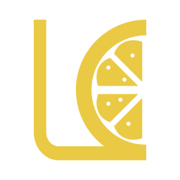

<div align="center">
<a href="https://github.com/sankeyangshu/lemon-template-vue">
  
</a>

<h1 align="center">
  lemon-template-vue
</h1>

English / [简体中文](./README.zh-CN.md)

A mobile web apps template based on the Vue 3 ecosystem.

<p>
  
  
  
  
  
</p>

[Docs](https://sankeyangshu.github.io/lemon-template-docs/vue/) / [Feedback](https://github.com/sankeyangshu/lemon-template-vue/issues)

</div>

---

## Introduction

🚀🚀🚀 **lemon-template-vue** is built using the latest technologies, including `Vue 3.5`, `Vite 6`, `Vant 4`, `Pinia`, `TypeScript`, and `UnoCSS`. It integrates features like `Dark Mode`, system theme colors, and Mock data.

You can directly start developing your business logic on this template! Hope you enjoy it. 👋👋👋

> [!NOTE]
> If this project is helpful to you, please click the "Star" button in the top-right corner. Thank you!

## Preview

👓 [Click Demo](https://lemon-template-vue.vercel.app/) (Switch to mobile view on PC browsers)

## Other Templates

- [lemon-template-react](https://github.com/sankeyangshu/lemon-template-react) - A mobile web apps template based on the React ecosystem

## Features

- ⚡️ Developed with Vue 3.5 + TypeScript using **＜script setup＞** single-file components
- ✨ Uses Vite 6 as the development and build tool (includes Gzip packaging, TSX syntax, proxy support, etc.)
- 🍕 Fully integrates TypeScript
- 🍍 Replaces Vuex with Pinia, offering lightweight and easy-to-use state management, with Pinia persistence plugin integrated
- 📦 Automatic component loading
- 🎨 Vant 4 component library
- 🌀 UnoCSS for instant atomic CSS
- 👏 Integrates multiple icon solutions
- 🌓 Supports Dark Mode
- 🌍 Multi-language support with i18n
- 🔥 ECharts for data visualization, with useECharts Hooks
- ⚙️ Unit testing using Vitest
- ☁️ Axios encapsulation
- 💾 Local Mock data support
- 📱 Browser compatibility with viewport vw/vh units for layouts
- 📥 Gzip compression for packaged resources
- 🛡️ Splash screen animation for first load
- 💪 Eslint for code linting, with Prettier for formatting
- 🌈 Uses simple-git-hooks, lint-staged, and commitlint for commit message standards

## Prerequisites

Familiarity with the following concepts will help you use this template effectively:

- [Vue 3](https://v3.vuejs.org/) - Basic syntax of `Vue 3`
- [Vite](https://vitejs.dev/) - Features of `Vite`
- [Pinia](https://pinia.vuejs.org/) - Features of `Pinia`
- [TypeScript](https://www.typescriptlang.org/) - Basic syntax of `TypeScript`
- [Vue Router](https://router.vuejs.org/) - Basic usage of `Vue Router`
- [Icones](https://icones.js.org/) - Recommended icon library for this project
- [UnoCSS](https://github.com/antfu/unocss) - High-performance, flexible atomic CSS engine
- [Vant](https://github.com/youzan/vant) - Mobile Vue component library
- [ECharts 5](https://echarts.apache.org/en/handbook/) - Basic usage of `ECharts`
- [Mock.js](https://github.com/nuysoft/Mock) - Basic syntax of `Mock.js`
- [ES6+](http://es6.ruanyifeng.com/) - Basic syntax of `ES6`

## Environment Setup

Ensure the following tools are installed locally: [Pnpm](https://pnpm.io/), [Node.js](http://nodejs.org/), and [Git](https://git-scm.com/).

- Use [pnpm >= 8.15.4](https://pnpm.io/) to avoid dependency installation and build errors.
- [Node.js](http://nodejs.org/) version `18.x` or above is required. Recommended: `^18.18.0 || >=20.0.0`.

## VSCode Extensions

If you use [VSCode](https://code.visualstudio.com/) (recommended), install the following extensions for improved efficiency and code formatting:

- [Vue - Official](https://marketplace.visualstudio.com/items?itemName=Vue.volar) - Essential for Vue development
- [UnoCSS](https://marketplace.visualstudio.com/items?itemName=antfu.unocss) - UnoCSS support
- [DotENV](https://marketplace.visualstudio.com/items?itemName=mikestead.dotenv) - `.env` file highlighting
- [Error Lens](https://marketplace.visualstudio.com/items?itemName=usernamehw.errorlens) - Better error visualization
- [EditorConfig for VS Code](https://marketplace.visualstudio.com/items?itemName=EditorConfig.EditorConfig) - Maintain consistent coding styles across IDEs
- [ESLint](https://marketplace.visualstudio.com/items?itemName=dbaeumer.vscode-eslint) - Script linting
- [i18n Ally](https://marketplace.visualstudio.com/items?itemName=lokalise.i18n-ally) - All-in-one i18n support
- [JavaScript and TypeScript VSCode Snippets](https://marketplace.visualstudio.com/items?itemName=sankeyangshu.vscode-javascript-typescript-snippets) - JS and TS snippets
- [Vue Collection VSCode Snippets](https://marketplace.visualstudio.com/items?itemName=sankeyangshu.vscode-vue-collection-snippets) - Vue 2/3 snippets

## Usage

### Use the Scaffold

> In development

### GitHub Template

[Use this template to create a repository](https://github.com/sankeyangshu/lemon-template-vue/generate)

### Clone

```bash
# Clone the project
git clone https://github.com/sankeyangshu/lemon-template-vue.git

# Enter the project directory
cd lemon-template-vue

# Install dependencies (use pnpm)
pnpm install

# Start the development server
pnpm dev

# Build for production
pnpm build
```

## Git Commit Guidelines

### Commit Standards

The project enforces Git commit messages using `simple-git-hooks` and `commitlint`, adhering to the widely adopted [Angular](https://github.com/conventional-changelog/conventional-changelog/tree/master/packages/conventional-changelog-angular) guidelines.

- `feat`: Add new features
- `fix`: Fix bugs
- `docs`: Documentation changes
- `style`: Code formatting (does not affect functionality, e.g., spacing, semicolons, etc.)
- `refactor`: Code refactoring (neither bug fixes nor new features)
- `perf`: Performance optimizations
- `test`: Add or update test cases
- `build`: Changes to build process or external dependencies (e.g., updating npm packages, modifying webpack configuration)
- `ci`: Changes to CI configuration or scripts
- `chore`: Changes to build tools or auxiliary libraries (does not affect source files or tests)
- `revert`: Revert a previous commit

## Community

You can use [issues](https://github.com/sankeyangshu/lemon-template-vue/issues) to report problems or submit a Pull Request.

## Browser Support

- For local development, we recommend using the latest version of Chrome. [Download](https://www.google.com/intl/en/chrome/).
- The production environment supports modern browsers. IE is no longer supported. For more details on browser support, check [Can I Use ES Module](https://caniuse.com/?search=ESModule).

| [](http://godban.github.io/browsers-support-badges/)</br>IE | [](http://godban.github.io/browsers-support-badges/)</br>Edge | [](http://godban.github.io/browsers-support-badges/)</br>Firefox | [](http://godban.github.io/browsers-support-badges/)</br>Chrome | [](http://godban.github.io/browsers-support-badges/)</br>Safari |
| :----------------------------------------------------------------------------------------------------------------------------------------------------: | :----------------------------------------------------------------------------------------------------------------------------------------------------------------------------------------------------: | :---------------------------------------------------------------------------------------------------------------------------------------------------------------------------------------------------------------: | :-----------------------------------------------------------------------------------------------------------------------------------------------------------------------------------------------------------: | :-----------------------------------------------------------------------------------------------------------------------------------------------------------------------------------------------------------: |
|                                                                      not support                                                                       |                                                                                            last 2 versions                                                                                             |                                                                                                  last 2 versions                                                                                                  |                                                                                                last 2 versions                                                                                                |                                                                                                last 2 versions                                                                                                |

## License

[MIT](./LICENSE) License © 2023-PRESENT [sankeyangshu](https://github.com/sankeyangshu)
